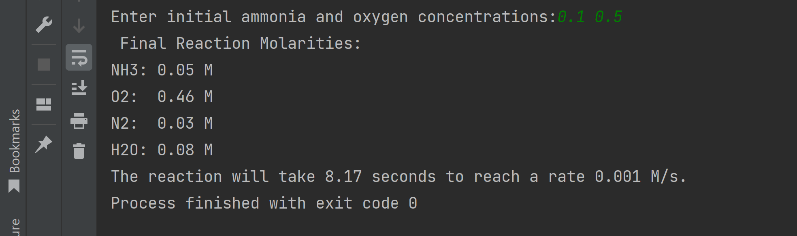

<h1>Chemical Kinetics Program</h1>

<h2>Problem Description</h2>
Project consists of simple recursive function that takes in ammonia and and oxygen concentrations from the user. It then performs a series of operations to calculate flow rate, reaction rate, and updated concentration rates. The completion of the exercise demonstrates the understanding and use of recursive functions.
 

<h2>Languages and Utilities Used</h2>

- <b>C</b> 

<h2>Environments Used </h2>

- <b>Windows 11</b>
- <b>C Lion</b>

<h2>Program sample output:</h2>

Terminal Output:

  

